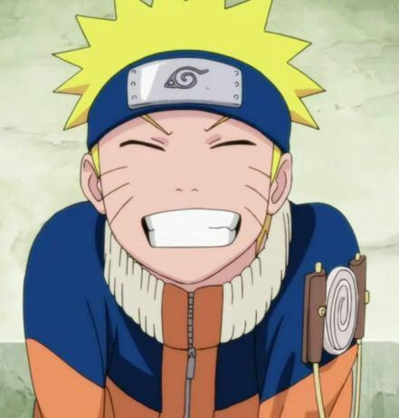

# Orgonograma de Naruto

## Descrição do Projeto

O "Orgonograma de Naruto" é um projeto desenvolvido como parte do programa Oracle Next Education, uma colaboração entre a Oracle e a Alura. Este projeto foi uma oportunidade emocionante de unir minha paixão pelo anime Naruto com meu interesse em desenvolvimento usando React.

O objetivo era criar um organograma empresarial, gerando cards personalizados para várias equipes. Cada card apresenta o nome do colaborador, seu cargo e uma imagem que anteriormente poderia ser selecionada  por meio de uma URL mas decidi optar pelo usuário selecionar uma imagem diretamente do computador. Esta melhoria na usabilidade simplificou significativamente o processo de inclusão de imagens.

### Melhorias Implementadas

- Inclusão da funcionalidade para seleção de imagens do computador.
- Personalização dos cards para diferentes equipes do anime naruto.
- Utilização de React para a construção do projeto.

## Vídeo do Projeto

## Agradecimentos

Gostaria de expressar minha profunda gratidão à Oracle e à Alura pelo incrível programa Oracle Next Education. Essa experiência foi enriquecedora, permitindo-me expandir minhas habilidades técnicas e aplicá-las em um projeto que me trouxe muita satisfação.

Foi um prazer desenvolver este projeto e espero que ele possa inspirar outros desenvolvedores, assim como eu fui inspirado por Naruto.

Muito obrigado!

